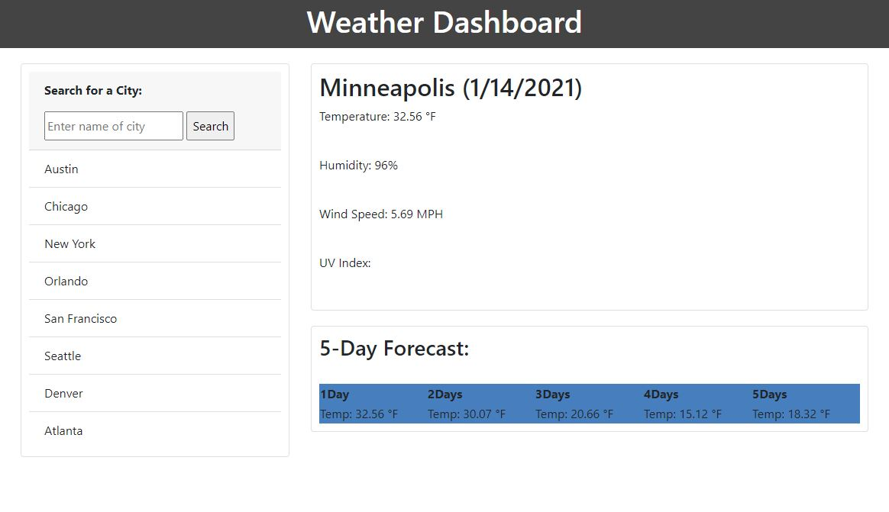

# Weather-Dashboard 

## Purpose of this project
It's a beautiful day even on ugly days if you've prepared yourself for the upcoming weathers, GOOD or BAD! WIth this weather page, it'll give you important info that you'll need to prepare for your next few days. It provides data on the temperature, humidity, and wind speed (MPH). 

## How to use
Just stare at the data. Literally. It's that easy.

## Future Improvements
Make the search button show any cities and provide more data. Also to populate the search results underneath the search bar.

## Screenshot

## Links
https://fongvang09.github.io/Weather-Dashboard/

https://github.com/fongvang09/Weather-Dashboard/settings
